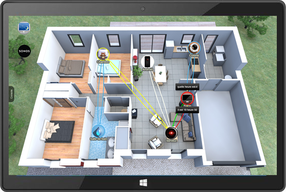
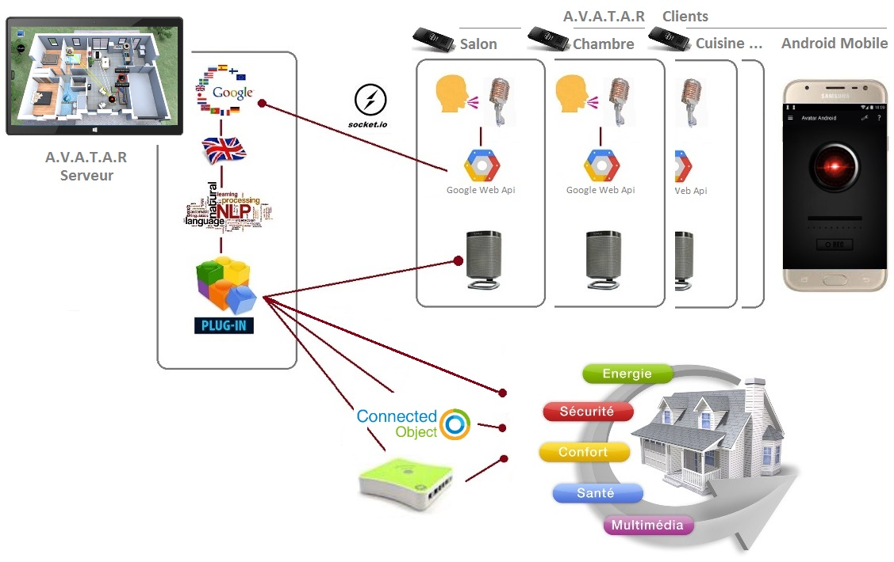

### _A.V.A.T.A.R est un assistant vocal basé sur la reconnaissance vocale du langage naturel et la restitution d'informations par synthèse vocale dédié à la conception d'une maison intelligente et à l'internet des objets._

***

A.V.A.T.A.R est developpé en [Node.js](https://nodejs.org/en/) et [Electron](https://electronjs.org/), ce qui permet d'utiliser les technologies web (Javascript, HTML et CSS). L'infrastructure (backend) est codée en Node.js et l'interface (frontend) est bâtie sur la base des outils Chromium, la partie open source de Google Chrome.

***
## ★ Principe d'utilisation
Le principe est de dicter vocalement une règle via un client qui est ensuite envoyée au serveur. Celui-ci la traduit en Anglais et l'analyse par [Traitement Naturel du Langage](https://fr.wikipedia.org/wiki/Traitement_automatique_du_langage_naturel). Si une intention est trouvée, le serveur déclenche ensuite le script Node.js associé. Ces scripts (ou plug-ins) interagissent avec tous les objets connectés (box domotiques, box TV, TV, enceintes Wi-Fi, lampes, gadgets…), l’Open Data (programmes TV, horaires de cinéma, météo du monde, wikipedia…) ou encore Google Assistant (Google Home).

Il est composé d'un serveur et de clients disposés dans les pièces de votre maison, plus des clients Android mobiles.

***
## ★ Plateformes supportées
### Serveur
- [X]&nbsp;Microsoft Windows 32/64 (7/8/10)

### Client
- [X]&nbsp;Microsoft Windows 32/64 (7/8/10)
- [X]&nbsp;OS Android >= 4.1 Jelly Bean (API 16)

***
## ★ Installation
1. Téléchargez le projet
2. Créez un répertoire `C:\Avatar`
3. Copiez les fichiers `Avatar.7z.001` et `Avatar.7z.002` du téléchargement dans ce répertoire
4. Dézipper l'application, utilisez [7z](https://www.01net.com/telecharger/windows/Utilitaire/compression_et_decompression/fiches/4035.html) (ou tout autre application pouvant dézipper du 7z)
	- Choisissez le fichier `Avatar.7z.001`
5. Vous pouvez supprimer les fichiers `Avatar.7z.001` et `Avatar.7z.002`
6. Double-cliquez sur le fichier `C:\Avatar3.0\Avatar.exe` pour démarrer le serveur A.V.A.T.A.R
7. Cliquez sur le node _Serveur_ puis choisissez dans le menu contextuel _Aide -> Documentation_
8. Suivez la documentation et téléchargez un client
	- [Voir le client Windows](https://github.com/Spikharpax/Avatar-Client)
	- [Voir le client Android](https://github.com/Spikharpax/Avatar-Plugin-android)

***
## ★ Plug-ins

Utilisez la bibliothèque de plug-ins interne à l'application pour télécharger et installer les plug-ins existants.

Liste de quelques plug-ins disponibles (en constante évolution):
- L'heure pour toutes les grandes villes du monde (interne A.V.A.T.A.R)
- La date pour toutes les grandes villes du monde (interne A.V.A.T.A.R)
- Redémarrage à la demande des clients A.V.A.T.A.R (interne A.V.A.T.A.R)
- Mode Intercom entre les clients A.V.A.T.A.R (interne A.V.A.T.A.R)
- [Domotique Jeedom](https://github.com/Seb85/Avatar-Plugin-jeedom)
- [Box domotique eeDomus](https://github.com/Spikharpax/Avatar-Plugin-Android)
- [Box domotique Fibaro](https://github.com/domodom/Avatar-Plugin-fibaro)
- [Sonos](https://github.com/Spikharpax/Avatar-Plugin-SonosPlayer)
	- Gestion de Sonos System avec la possibilité d'utiliser les Players comme enceintes Wi-FI pour les clients A.V.A.T.A.R
	- Intégration Spotify incluse (compte Premium)
	- Coupure et remise du son automatique lors d'un dialogue
	- Intégration de la fibre optique pour le 5:1
- [Google Assistant (Google Home)](https://github.com/Spikharpax/Avatar-Plugin-Google-Assistant)
- [Kodi](https://github.com/domodom/Avatar-Plugin-kodi)
- [La météo pour toutes les grandes villes du monde](https://github.com/Spikharpax/Avatar-Plugin-meteo)
- [La blague du jour](https://github.com/Spikharpax/Avatar-Plugin-blague)
- [Traduction](https://github.com/Spikharpax/Avatar-Plugin-translate)
- [Gestion des ampoules RGBW Wifi Mi-Light](https://github.com/Spikharpax/Avatar-Plugin-milight)
- [Gestion de la box Free Revolution](https://github.com/Spikharpax/Avatar-Plugin-freebox)
- [Programmes TV par l'EPG de le Freebox Revolution avec rappel vocale et enregistrement de programme](https://github.com/Spikharpax/Avatar-Plugin-freeboxTV)
- [Création de scénarios](https://github.com/Spikharpax/Avatar-Plugin-scenariz)
- [Programmes TV avec rappel vocale et enregistrement de programme (Toutes box TV)](https://github.com/Spikharpax/Avatar-Plugin-tvSchedule)
- [Wikipedia](https://github.com/Spikharpax/Avatar-Plugin-wikipedia)
- [Minuteur - Alarme](https://github.com/Spikharpax/Avatar-Plugin-Minuteur)
- [Marmiton (recettes)](https://github.com/domodom/Avatar-Plugin-Marmiton)
- [Radio](https://github.com/domodom/Avatar-Plugin-Radio)
- Liste de courses (disponible sur demande)

D'autres plugins sont mis régulièrement sur ce Github ou sur ceux de la communauté. 
Pour le reste, tout est possible. A vous de jouer pour intégrer tout ce que vous voulez (et n'oubliez pas de partager en devenant contributeurs!)

Veuillez suivre la documentation pour plus d'information.

***
## ★ Crédits
- [SARAH - (Home Automation)](https://github.com/JpEncausse)
- [AVA - (Agnostic Virtual Assistant)](https://github.com/ava-ia/core)

***
## ★ License
Logiciel libre sous [licence MIT](https://github.com/Spikharpax/A.V.A.T.A.R/blob/master/LICENSE)

Copyright (c) 2018 A.V.A.T.A.R - Stéphane Bascher
